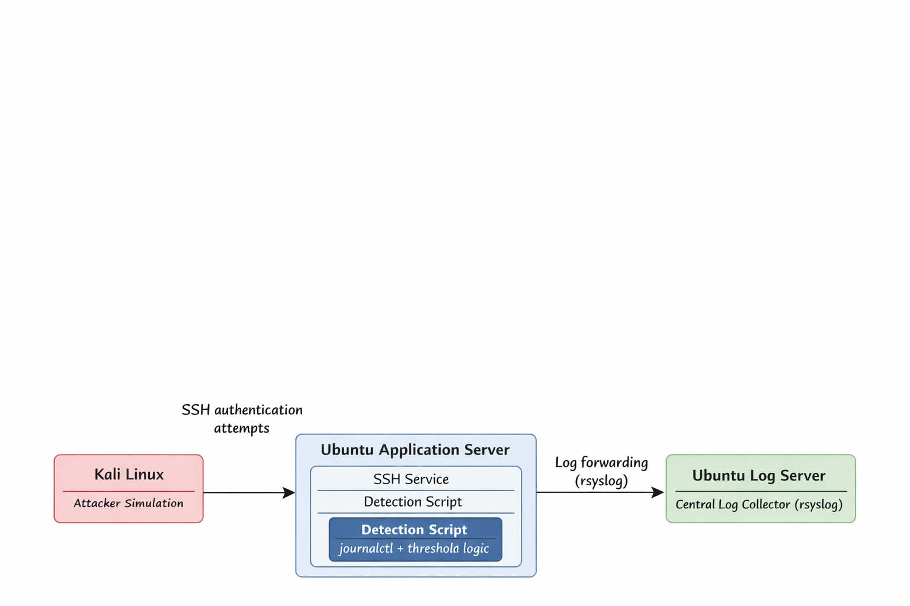

# Security Monitoring & Log Analysis Lab

A hands-on security monitoring project designed to simulate real-world SOC detection workflows using centralized logging and host-based alerting.

## Overview
This project demonstrates the design and implementation of a centralized Linux log monitoring pipeline with automated SSH brute-force detection.

The lab simulates real-world monitoring architecture using virtual machines and focuses on detection engineering, log aggregation, and alert generation.

## This project was created to gain hands-on, foundational understanding of how monitoring and detection systems operate at a low level. 

Rather than relying solely on pre-built SIEM platforms, the goal was to understand log generation, log flow, time-based filtering, threshold logic, and alert creation from the ground up.

A strong understanding of these fundamentals is essential for effective incident investigation, root cause analysis, and troubleshooting in real-world security operations environments.

---
## Key Features

- Centralized log aggregation across Linux hosts
- Host-based SSH brute-force detection with automated alerting
- Time-window analysis using system-level log filtering
- Threshold-based detection engineering approach
- Incident documentation following SOC reporting structure
- Risk assessment and mitigation planning

## Architecture
### Architecture Diagram

### Components
- Kali Linux (attacker simulation)
- Ubuntu Application Server (log source & detection engine)
- Ubuntu Log Server (central log collector)

### Log Flow
1. SSH authentication logs are generated on the Ubuntu Application Server.
2. Logs are analyzed locally using time-based journald filtering.
3. If the defined threshold is exceeded, an alert is generated.
4. Logs and alerts are forwarded to the centralized log server via rsyslog.

---

## Detection Logic

The detection mechanism is based on:

- Time-based filtering using:
  `journalctl --since "1 minute ago"`
- Pattern matching for:
  `Failed password`
- Aggregation per source IP address
- Threshold condition:
  More than 5 failed login attempts within one minute
- Alert generation using:
  `logger -p user.err`

---

## Example Alert
ALERT: SSH brute force detected from 192.168.180.131 (11 failed attempts in last minute)

Alerts are logged locally and forwarded to the centralized log server.

---

## Key Security Concepts Demonstrated

- Host-based detection
- Centralized log aggregation
- Threshold-based alerting
- Time-window analysis
- Basic incident response workflow
- Detection limitations and improvement planning

---

## Limitations

- Fixed time window detection (non-sliding)
- No cross-host event correlation
- No SIEM dashboard integration
- No automated IP blocking

---

## Future Improvements

- Sliding window detection logic
- Integration with SIEM platform (Elastic / Wazuh)
- Multi-host correlation
- Geolocation enrichment
- Automated containment (firewall / Fail2Ban integration)

---

## Repository Structure
security-monitoring-log-analysis-lab/
│
├── architecture/
├── linux-detection/
├── incident-report/
└── README.md

## Security Operations Perspective

This project emphasizes practical understanding of monitoring workflows used in Security Operations Centers (SOC). 

The implementation demonstrates:

- Log ingestion and normalization concepts
- Detection logic design
- Alert validation
- Risk evaluation based on context (internal vs external source)
- Consideration of false positives and false negatives
- Identification of architectural limitations

The lab serves as a foundational model that can be extended into a full SIEM-based monitoring solution.